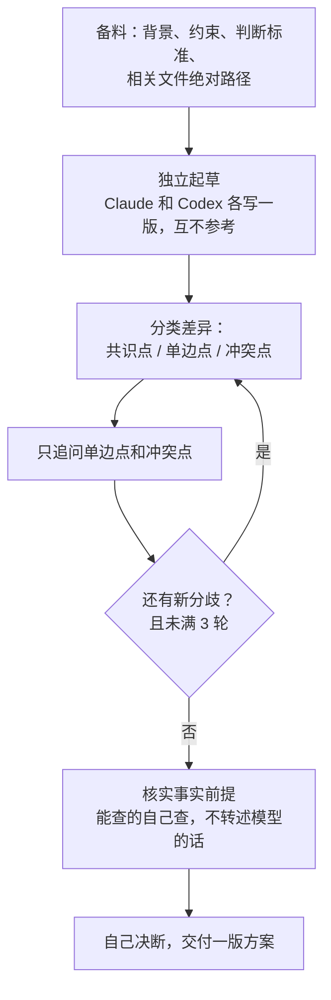
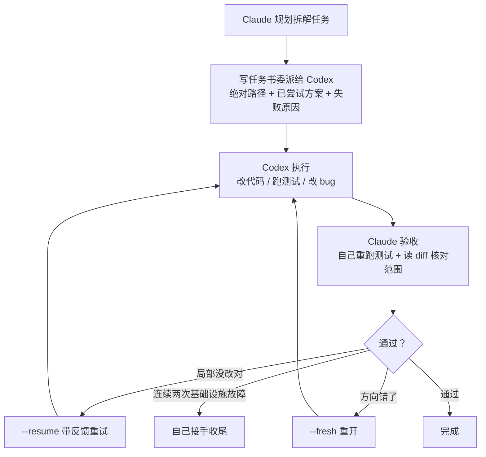

# Codex × Claude Code 协作纪律

两个 Skill，分别解决两个问题：`codex-coplan` 管**提智力**，`codex-orchestrator` 管**省资源**。前者引入一个真正独立的第二视角共同推敲方案，让最终结论比单模型闷头想出来的更靠谱；后者把执行阶段的脏活交给 Codex，token 消耗走 Codex 侧、不占 Claude 额度，主线上下文也不会被执行噪音拖垮。

这不是"怎么调用 Codex"的接入教程——那部分官方插件已经做了。这里要解决的是：接入之后，怎么用才不白搭。

## 先说会遇到什么问题

如果你已经在用 Claude Code + Codex 这类双模型组合，大概率遇到过以下几种情况：

- **"问问第二个模型的意见"其实只问出了回声**。把自己写好的方案丢给另一个模型，问"你怎么看"，对方大概率顺着你的框架点头，再提几个无关痛痒的修饰意见。这不是独立视角，是一次自我确认——却会让你误以为方案已经经过了交叉验证。
- **两个模型讨论方案，讨论着讨论着开始说同一句话**。来回追问几轮，表面上"达成共识"，实际是互相锚定、逐渐趋同，第二视角的价值在讨论过程中被磨掉了，最后还是得你自己拍板——等于全程陪跑。
- **主会话跑着跑着开始变蠢**。一个大任务几十轮工具调用下来，改代码、跑测试、看报错，中间产出全堆在上下文里，后面的判断明显比开头草率——不是模型变笨了，是有效信息被自己制造的噪音稀释了。
- **委派出去的任务，回来自称"已完成"，实际没做对**。文件写错了目录，测试根本没跑，模型照样汇报"测试通过"。不逐条读 diff 核实，这种委派比不委派更危险。

这两个 Skill 就是针对上述四类问题写的操作纪律，不是"接个 API 就能用"的功能封装。

## 核心设计思路

两个 Skill 表面上管不同的事，底层贯穿着同三条原则：

- **独立性是多模型协作价值的唯一来源**。两个模型一上来就互相看到对方的输出，讨论会迅速趋同，"两个视角"退化成"一个视角外加一句附和"。所以 `codex-coplan` 强制第一轮独立起草、互不参考，独立性只有在被污染之前才存在，污染之后补救不了。
- **模型的自我报告不能当事实，只能当待验证的陈述**。"Codex 说任务已完成"和"另一个模型说它考虑过某个约束"，本质上是同一类不可靠信息——陈述本身就可能是错的。所以 `codex-orchestrator` 验收时要求重跑测试、读 diff，`codex-coplan` 遇到分歧时要求去查事实本身，而不是转述对方怎么说。
- **用不用、用到什么程度，决策权在人，不在模型**。两个 Skill 都不会看到关键词就自动接管——用户没点名，都不会加载；`codex-orchestrator` 也不会替用户算"这活值不值得委派"的经济账。协作纪律管的是"怎么用"，不能反过来替用户决定"要不要用"。

## codex-coplan：让方案质量超过单模型闷头想



方案阶段，两个模型共同推敲出一版方案，解决的是智力问题，不是资源问题。

核心是保证"第二意见"真的独立，而非自我确认的幻觉：先各自独立写一版方案、互不参考，再只针对真正的分歧点追问；追问时优先核实客观事实（这个字段存不存在、这个权限有没有），而不是被动接受模型转述的说法。两个独立视角汇合之后，才能避开单个模型自己想不到的盲区——最终交付一份吸收双方意见的方案，不允许甩一句"Codex 认为……我认为……"就把判断题丢给你自己做。

## codex-orchestrator：把执行阶段的脏活交出去



执行阶段，Claude 规划 + Codex 干活，解决的是资源问题，不是智力问题。

把"写代码 → 跑测试 → 改 bug"这种会产生大量中间噪音的循环，整个交给 Codex。执行 token 烧在 Codex 侧、不占 Claude 额度，主线 Claude 只做任务拆解和验收，上下文不被执行细节污染。核心是把委派最容易翻车的几个坑写成硬性规则：沙箱可写根目录到底是哪个、Codex 自称"已完成"为什么不能信、改动没改对该用 `--resume` 追加还是方向错了该用 `--fresh` 重开。

## 安装

### 第一步：在 Claude Code 里接入 Codex 官方插件

这两个 Skill 依赖 [OpenAI 官方 Codex 插件](https://github.com/openai/codex-plugin-cc)，如果还没装，先在 Claude Code 里执行：

```bash
/plugin marketplace add openai/codex-plugin-cc
/plugin install codex@openai-codex
/reload-plugins
/codex:setup
```

`/codex:setup` 会检测本机 Codex CLI 是否就绪：没装会提示是否用 `npm install -g @openai/codex` 帮你装，装了但没登录会提示用 `!codex login` 登录。全部就绪后，`/agents` 列表里应该能看到 `codex:codex-rescue` 子代理，说明插件已经生效。

官方插件的前提条件（来自 [官方 README](https://github.com/openai/codex-plugin-cc)）：

- ChatGPT 订阅（含免费版）或 OpenAI API key——这两个 Skill 委派执行时消耗的 token，走的正是这条线，不占 Claude 侧额度
- Node.js 18.18 或更高版本

### 第二步：装这两个 Skill

```bash
git clone https://github.com/jiayx01/codex-claude-skills.git
cp -r codex-claude-skills/skills/codex-coplan codex-claude-skills/skills/codex-orchestrator ~/.claude/skills/
```

装好之后正常使用 Claude Code，在需要的场景里点名即可：

- 「和 codex 讨论一下这个方案」「问问 codex 怎么看」→ 触发 `codex-coplan`
- 「这个甩给 codex 做」「用 codex 把这几个测试修了」→ 触发 `codex-orchestrator`

`codex-orchestrator` 里的 `--model`/`--effort` 参数，需要换成你自己账号或网关实际支持的值。

## 适合谁

- 已经在用 Claude Code，并且有独立可用的 Codex 访问权限（不限接入方式）的人
- 需要"真第二意见"来验证方案，或者需要把大块执行任务甩出去、保持主线上下文干净的人

## 不适合什么

- 只用单一模型、没有第二个独立模型可用——这套东西的前提是你手上确实有两个独立的判断源，不是靠 prompt 让同一个模型扮演两个角色
- 想要全自动、不需要人管的黑盒方案——这两个 Skill 恰恰依赖明确的人工验收和最终裁决来把关，不是让两个模型商量着自己定

## License

MIT
