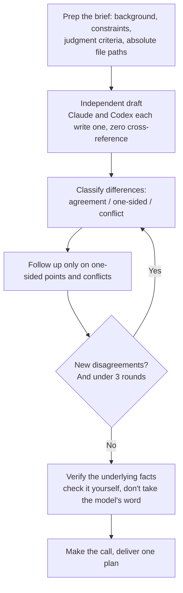
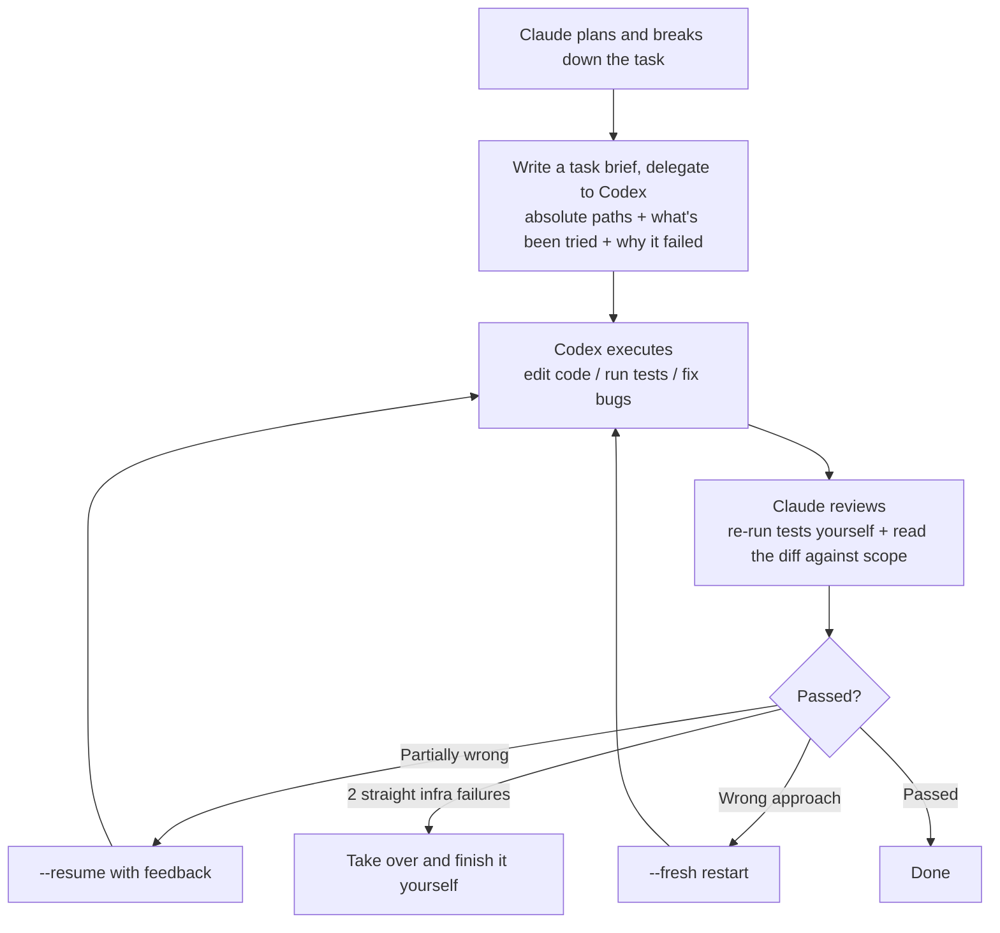

# Codex × Claude Code Collaboration Discipline

[简体中文](README.zh-CN.md)

Two Skills, two different problems: `codex-coplan` handles **intelligence** — bring in a genuinely independent second opinion and land on a plan that's better than either model would produce alone. `codex-orchestrator` handles **resource cost** — hand execution grunt work off to Codex so the tokens burn on Codex's side instead of your Claude quota, and your main thread's context doesn't get dragged down by execution noise.

This isn't a "how to call Codex" integration guide — the official plugin already covers that. This is about what to do once you're connected, so the connection doesn't go to waste.

## The problems you'll recognize

If you're already running Claude Code and Codex as a two-model setup, you've probably hit some of these:

- **"Ask the other model for its opinion" often just returns an echo.** Hand your drafted plan to another model and ask "what do you think," and it'll likely nod along with your framing and offer a few cosmetic tweaks. That's not an independent perspective — it's self-confirmation dressed up as cross-validation.
- **Two models discussing a plan start saying the same thing.** A few rounds of back-and-forth in, it looks like "consensus," but it's really anchoring — the value of the second perspective erodes as the discussion goes on, and you end up making the call yourself anyway. The extra rounds bought latency, not signal.
- **The main session gets dumber the longer it runs.** Dozens of tool calls into a large task — edit, test, read the error, repeat — and judgment noticeably degrades from where it started. The model isn't getting worse; the signal is being diluted by the noise it's generating.
- **A delegated task comes back marked "done" when it isn't.** Files land in the wrong directory, tests never actually ran, and the model reports "tests passing" anyway. Skip reading the diff line by line, and delegation like this ends up worse than doing the work yourself.

Both Skills are operational discipline written specifically against these four failure modes — not a thin wrapper around an API call.

## Core design principles

The two Skills manage different things on the surface, but they run on the same three underlying principles:

- **Independence is the only source of value in multi-model collaboration.** The moment two models see each other's output, discussion converges fast — "two perspectives" degrades into "one perspective plus an echo." That's why `codex-coplan` forces an independent first draft with zero cross-reference: independence only exists before contamination, and there's no recovering it after.
- **A model's self-report is not a fact — it's an unverified claim.** "Codex says the task is done" and "the other model says it accounted for some constraint" are the same category of unreliable information: the claim itself might just be wrong. That's why `codex-orchestrator` requires re-running tests and reading diffs at review time, and `codex-coplan` requires checking the underlying fact whenever there's disagreement, instead of taking either model's word for it.
- **The decision to use this — and how much — belongs to the human, not the model.** Neither Skill activates on keyword-matching alone; without an explicit mention, neither one loads. `codex-orchestrator` doesn't run a cost-benefit check on your behalf, either. Discipline governs *how* to use it — it doesn't get to decide *whether* you should.

## codex-coplan: get a plan better than either model alone



Plan-stage work, where two models jointly work out a plan. This solves an intelligence problem, not a resource problem.

The core mechanism is making sure the "second opinion" is genuinely independent, not a hallucinated confirmation: each side drafts separately with zero cross-reference, and follow-ups then target only the real points of disagreement — prioritizing verification of the underlying fact (does this field exist, is this permission actually granted) over taking either model's account at face value. Once two independent perspectives converge, you catch blind spots that either model would've missed alone — and the final deliverable is one plan that has absorbed both viewpoints, never a punt like "Codex thinks X, I think Y" that leaves the judgment call to you.

## codex-orchestrator: hand off the execution grunt work



Execution-stage work: Claude plans, Codex executes. This solves a resource problem, not an intelligence problem.

The "write code → run tests → fix bugs" loop generates a lot of intermediate noise — hand the whole thing to Codex. Execution tokens burn on Codex's side and never touch your Claude quota; the main Claude thread only plans and reviews, so its context stays clean. The core value here is turning the easiest ways to get burned by delegation into hard rules: which directory is actually the sandbox's writable root, why Codex claiming "done" can't be trusted, and whether a failed attempt calls for `--resume` with feedback or a `--fresh` restart because the whole approach was wrong.

## Install

### Step 1: Connect the official Codex plugin in Claude Code

Both Skills depend on the [official OpenAI Codex plugin](https://github.com/openai/codex-plugin-cc). If you haven't installed it yet, run this inside Claude Code:

```bash
/plugin marketplace add openai/codex-plugin-cc
/plugin install codex@openai-codex
/reload-plugins
/codex:setup
```

`/codex:setup` checks whether the Codex CLI is ready on your machine: if it's missing, it'll offer to install it via `npm install -g @openai/codex`; if it's installed but not logged in, it'll prompt you to run `!codex login`. Once everything's set up, you should see the `codex:codex-rescue` subagent in your `/agents` list, confirming the plugin is active.

Prerequisites for the official plugin (from its [README](https://github.com/openai/codex-plugin-cc)):

- A ChatGPT subscription (including the free tier) or an OpenAI API key — this is the line delegated execution tokens run on, and it never touches your Claude-side quota
- Node.js 18.18 or later

### Step 2: Install these two Skills

```bash
git clone https://github.com/jiayx01/codex-claude-skills.git
cp -r codex-claude-skills/skills/codex-coplan codex-claude-skills/skills/codex-orchestrator ~/.claude/skills/
```

Once installed, use Claude Code as usual and just name Codex when the scenario calls for it:

- "Let's discuss this with Codex" / "What does Codex think about this?" → triggers `codex-coplan`
- "Hand this off to Codex" / "Have Codex fix these failing tests" → triggers `codex-orchestrator`

The `--model`/`--effort` flags inside `codex-orchestrator` need to be swapped for whatever your own account or gateway actually supports.

## Who this is for

- Anyone already running Claude Code with independent, working access to Codex, however it's connected
- Anyone who wants a genuine second opinion to pressure-test a plan, or needs to offload large execution tasks while keeping the main thread's context clean

## Who this isn't for

- Anyone running a single model with no second, independent model available — this whole approach assumes you actually have two independent sources of judgment, not one model prompted into playing two roles
- Anyone wanting a fully automatic, hands-off black box — these two Skills specifically depend on explicit human review and final judgment calls; they're not two models quietly deciding things between themselves

## License

MIT
